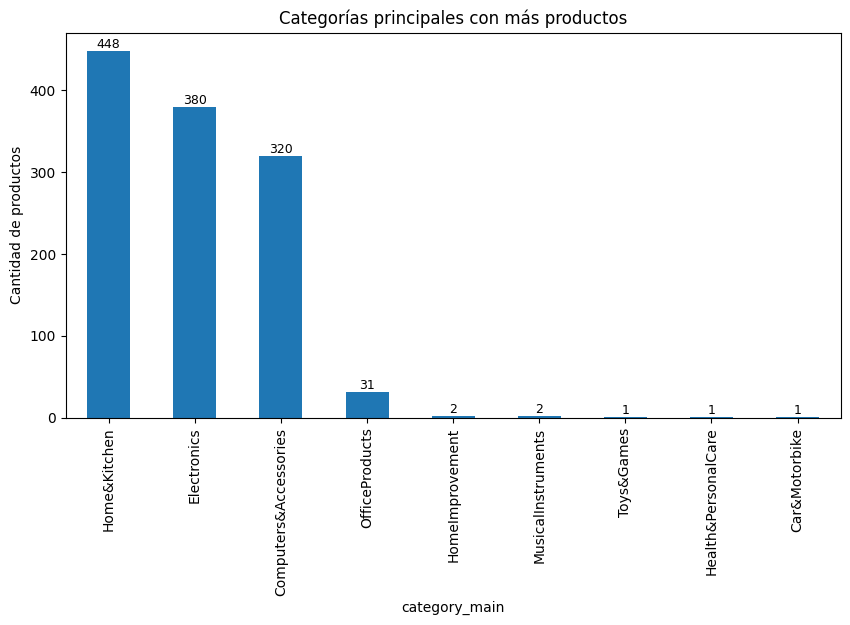
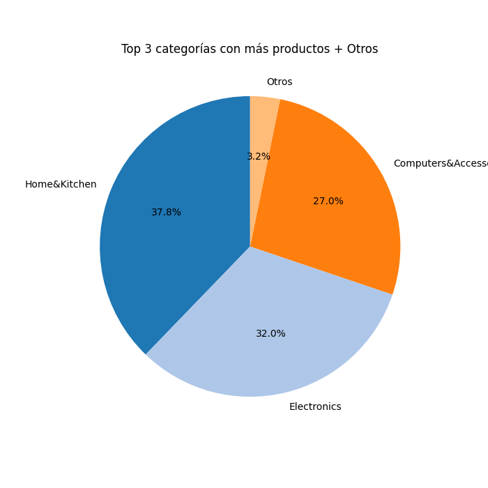
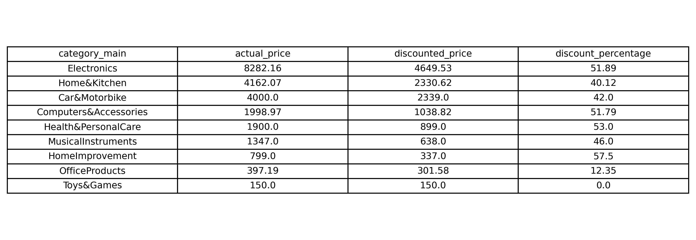
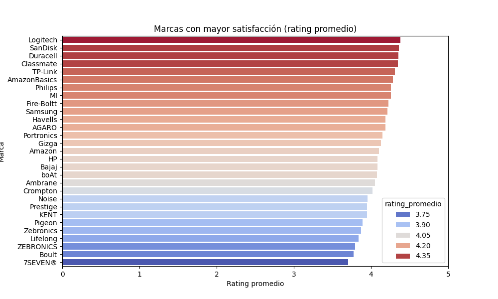
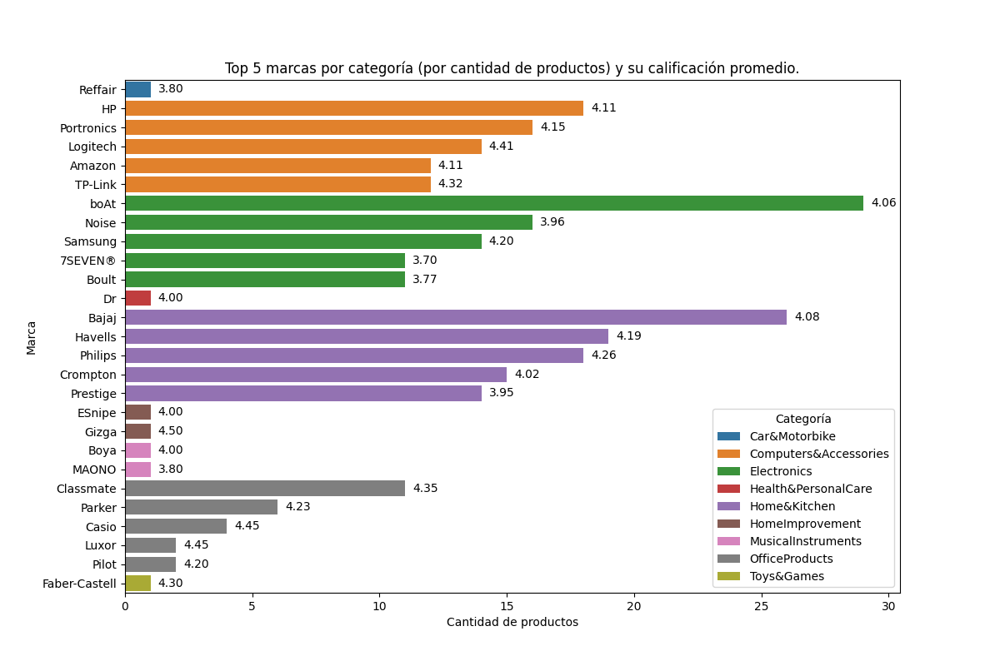
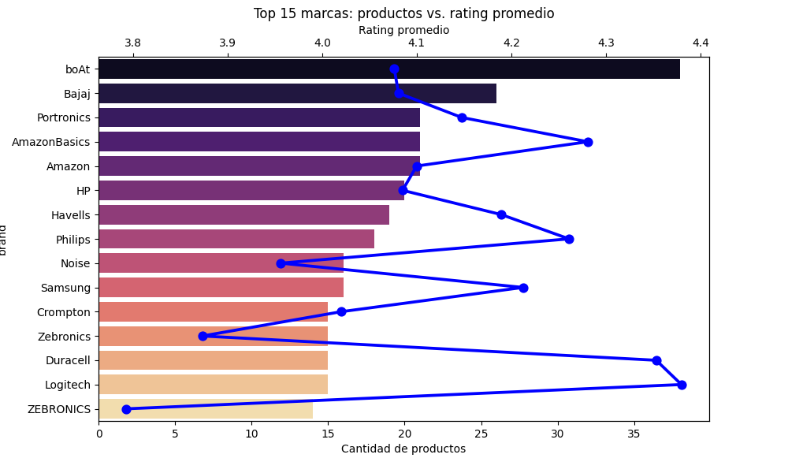
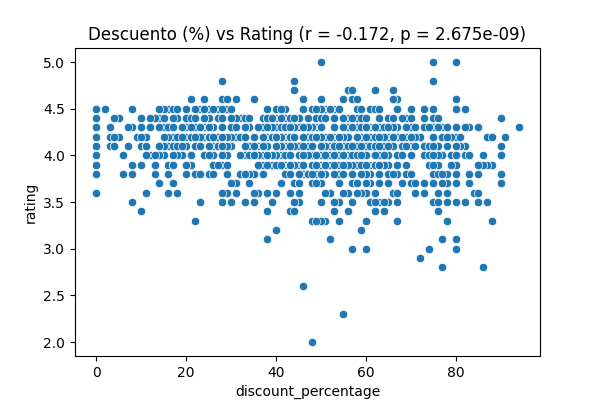
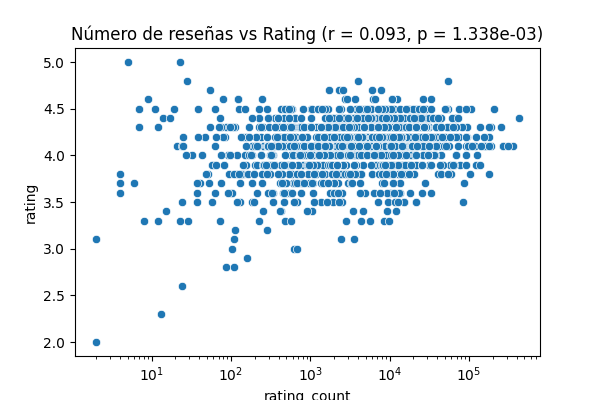

# Análisis de ventas Amazon

**Objetivo**: Identificar los factores que influyen en la satisfacción y compra de los clientes (precio, descuento, categoría, reseñas) para mejorar la estrategia de ventas y posicionamiento de productos en Amazon.

Se busca responder:

- [¿Qué tipos de productos se manejan en este dataset de amazon?](#categorías-principales)

- [¿Las marcas con más productos son también las mejor calificadas?](#top-15-marcas-y-sus-puntuaciones-promedio)

- [¿Qué categorías tienen los precios promedio más altos, más bajos y mayores descuentos?](#categorías-con-precios-promedio)

- [¿Existe relación entre porcentaje de descuento y calificación promedio?](#porcentaje-de-descuento-y-puntuaciones)

- [¿Existe relación entre cantidad de reseñas y puntuación?](#número-de-reseñas-y-puntuaciones)

# 📊 Flujo de trabajo del análisis

1. Dataset de productos → limpieza → productos limpios (productos_limpios.csv).
2. Dataset de reseñas → limpieza → reseñas limpias (reseñas_limpias.csv).
3. Ambos se unen por `product_id`.
4. Resultado: dataset combinado (productos_reseñas.csv).

# Validación de datos

- Puntuaciones 1-5 ✅
- Precio con descuento menor o igual a precio actual ✅
- Porcentajes de descuento entre 0 - 100% ✅
- Reseñas mayores a cero ✅
- Tipos de datos correctos ✅

# Creación de columnas

- **category_main**
- **brand**

Se decidió agrupar por categorías principales y marcas, para conocer diferentes hallazgos de nuestro dataset.

## Hallazgos

### Categorías principales

Contamos con 9 categorías únicas principales, de las cuales podemos identificar cuáles tienen más cantidad de productos.

 

### Categorías con precios promedio

- Precio promedio más alto → La categoría cuyos productos tienen el mayor valor en el mercado (lujo o alta gama).

- Precio promedio más bajo → La categoría más accesible en términos de costo.

- Mayor descuento promedio → La categoría donde las ofertas/promociones son más agresivas, lo que puede indicar alta competencia o estrategias de marketing.

### Conociendo las marcas que manejamos

 

### Top 15 marcas y sus puntuaciones promedio

El número de productos que ofrece una marca no muestra relación con la calificación promedio de sus productos. Algunas marcas con gran variedad no necesariamente son las mejor evaluadas.

### Porcentaje de descuento y puntuaciones

### Número de reseñas y puntuaciones

# Conclusiones

- `Diversificar productos en distintas categorías como Musical Instruments, Health&Personal Care, HomeImprovement.`

- `Diversificar productos con precios variados en categorías como Toys&Games, HomeImprovement, que pueden tener esa flexibilidad.`

- `Mayores descuentos no implican mejores puntuaciones en reseñas.`

- `El número de reseñas no se relaciona con las puntuaciones.`
